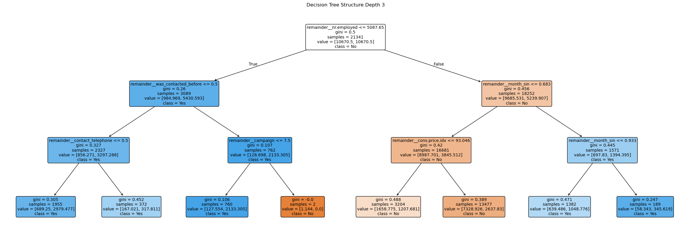
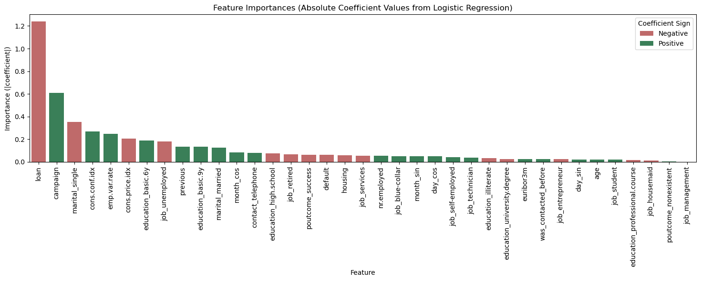

# 17.1-Comparing-Classifiers

## Description
This project exmamines the findindings of _Assignment 7.1, which examines the effect of marekting campaigns on having customers sign up for long term subscription deposits (these wouold be CDs in the US)_: for the Professional Certificate in Machine Learning and Artificial Intelligence from UC Berkely.  The bulk of the work is in the prompt_III.ipynb

## Results
- _The SVC model with a linear kernel had the best recall results_ 
    - _Optimizing for recall is important as we want to ensure we don't miss candidates likely to make a long term deposit subscription_
    - _It also is slow to train and difficult to optimize_
- _Oddly a decision Tree of depth 2 had relatively decent results_
- _The KNN model required resampling the data for the KNN classifier to achieve parity with the other classifiers.  It also had the highest precsion_
- _In general, one can see the tradeoff between precision and recall driving one higher tends to driver the other lower_ 
- _Using logistic regression to deteremine the important Coefficients and then training a SVM model can be very benficial to reduce tcompute time_

### _Conclusions_
- _The fact that the decision tree decided to use the number of employees at the bank warrants further investigation to determine why?_
    - _Is it acatually a leading or trailing economic indicator?_
    - _Are there a core group of people who are augmented by seasonal employees?_
 
    
- _Based on the coeficients:_
    - _People with loans seem far less likely to make a long term deposit subscription_
    - _Having been a target of previous campains seems to indicate a person is more likely to make a subscription_
    - _Being single is correlated with not wanting a subscription_
    - _The economy plays significant roll in the success of getting a subscription_
    - _There is slight seasonality to the success of subscriptions particularly around the new year_

 
